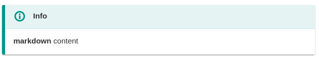
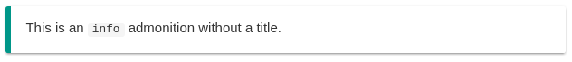
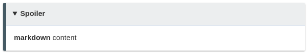
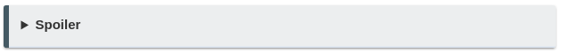
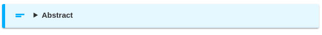
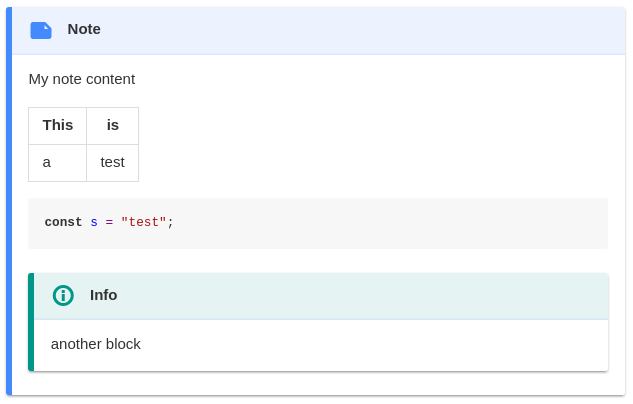
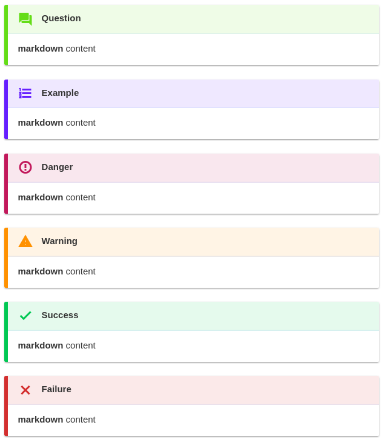

# Inkdrop Admontion

An [Inkdrop](https://www.inkdrop.info/) plugin that allows to add block-styled side content to your notes.

## Motivation

As I mainly write my notes in markdown using Inkdrop admonitions help me to write a more structured content and collapsible blocks can make my notes easier to read.

_The inspiration for this plugin came from the MkDocs [admonition extension](https://squidfunk.github.io/mkdocs-material/extensions/admonition/)._

## Install

```
ipm install admontion
```

## Usage

There are currently 10 different admonition types: `note`, `info`, `question`, `abstract`, `danger`, `warning`, `success`, `fail`, `example` and `spoiler`.

To create a new `info` admonition with the title "Info" use following syntax:
```
[[info | Info]]
| **markdown** content
```



In order to create a block without a title just leave it out:
```
[[info]]
| This is an `info` admonition without a title.
```



### Spoiler

The `spoiler` admonition is special as it collapsible, doesn't have an icon and always requires a title:
```
[[spoiler | Spoiler]]
| **markdown** content
```






To make a "normal" admontion collapsible just add `-spoiler` to the type e.g. `abstract-spoiler`.

```
[[abstract-spoiler | Abstract]]
| **markdown** content
```


 _As soon as you make a "normal" admonition collapsible the title becomes mandatory._

### Complex Content

You can add any kind of markdown content inside of an adminition, e.g.:

```
[[note | Note]]
| My note content
|
| | This | is   |
| |:-----|:-----|
| | a    | test |
| 
| ```js
| const s = "test";
| ```
| [[info | Info]]
| | another block
```



### Keymapping

By default the shortcut <kbd>Ctrl</kbd> + <kbd>Alt</kbd> + <kbd>a</kbd> will add a new (note) admonition and everything that is currently selected will be placed inside of it.

## Screenshots
Remaining admonitions:

